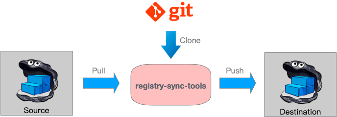

# registry-sync-tools

registry-sync-tools is a `Kubernetes-native` tool that syncs specific images from one docker registry to another.

## Principle



## Usage

* step1: Buind Image

  ```bash
  docker build -t registry-sync-tools:1.0 -f docker/Dockerfile .
  ```

* step2: Helm Install

  ```bash
  helm install --namespace xxx --name registry-sync-tools chart/registry-sync-tools
  ```

## Results

`registry-sync-tools` runs on Kubernetes as a cronjob:

```bash
# kubectl get pods -nxxx|grep sync
registry-sync-tools-1522667800-l68rs                                      0/1       Completed   0          14m
registry-sync-tools-1522668100-b5xlr                                      0/1       Completed   0          9m
registry-sync-tools-1522668400-5r7mm                                      0/1       Completed   0          4m
registry-sync-tools-b69xbd7x-cyax7                                        1/1       Running     0          28m
```

`registry-sync-tools` consists of two components(dind and Kubernetes cronjob) that share a common shared storage consisting of pvc.

## Refs

* [migrator](https://github.com/duyanghao/migrator)
